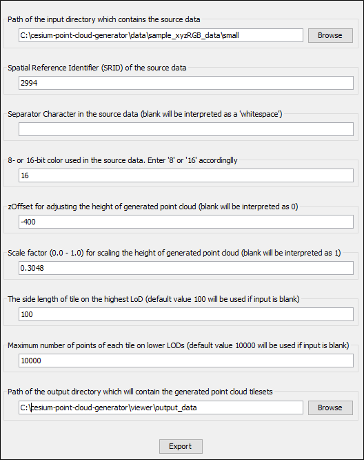
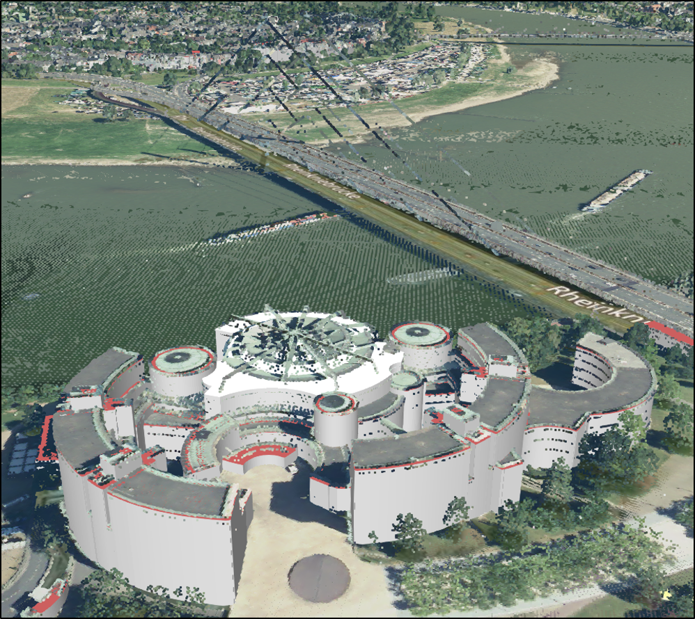
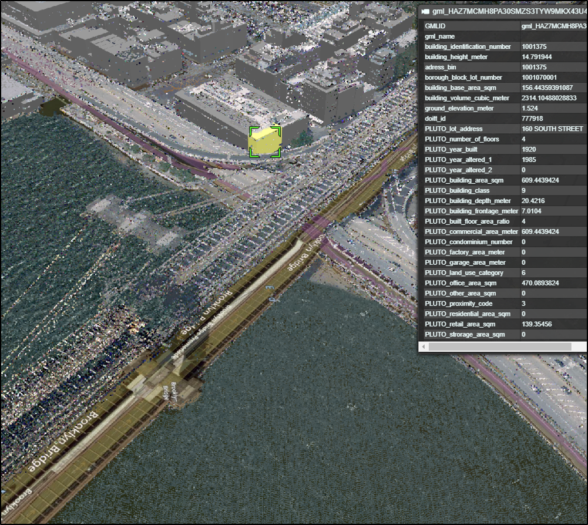

# Cesium Point Cloud Generator

## Introduction
The Cesium Point Cloud Generator (CPCG) is a small Java-based tool for the generation of point cloud visualization datasets according to [Cesium 3D Tiles](https://github.com/AnalyticalGraphicsInc/3d-tiles). By utilizing a local portable SQLite database, it takes 3D point cloud datasets given as XYZ text files (possibly including RGB color information for each point) and generates a 3DTiles point cloud to be used for interactive 3D viewing using the Cesium WebGL Digital Globe. The tool is capable of generating multiple levels of detail to increase viewing performance. The generated point cloud datasets can be visualized in a [Cesium](https://cesiumjs.org/index.html)-based web client, such as the [3DCityDB Web Map Client](https://github.com/3dcitydb/3dcitydb-web-map).

The tool was developed by [Zhihang Yao](https://www.gis.bgu.tum.de/unser-team/ehemalige/zhihang-yao/) at the [Chair of Geoinformatics](https://www.gis.bgu.tum.de/startseite/), [Technical University of Munich](https://www.tum.de/).

### Project Structure
The project consists of several packages and folders, which are described as follows:

| Folder  | Description |
| ------------- | ------------- |
| [src](src/)  | Contains all source codes in Java |
| [data](data/)  | Contains sample data used for testing |
| [lib](lib/)  | Contains Java libraries (`*.jar`) required for the project |
| [viewer](viewer/)  | Contains a Cesium instance used for visualizing the generated point clouds stored in [viewer/output_data](viewer/output_data/) |

### Run Instructions

1. Download or clone this repository on your local machine:
	```bash
	git clone https://github.com/tum-gis/cesium-point-cloud-generator
	```

2. You can either import the cloned repository in a Java IDE (e.g. Eclipse, NetBeans, etc.) and execute the [Main.java](src/de/tum/gis/tiles3d/) class, or you can run the stand-alone [CesiumPointCloudGenerator.jar](CesiumPointCloudGenerator.jar) file by double-clicking or using the following command:
	```bash
	java -jar CesiumPointCloudGenerator.jar
	```
	
3. A window appears, where all the program configurations are shown:
	<div align="center">
	  
	</div>

	These settings can be configured as follows:

	| Argument  | Description | Default value |
	| ------------- | ------------- | ------------- |
	| Input path  | Input folder that contains all the source data; the sample data included in this project were converted from LAS/LAZ format, which can be found [here](https://github.com/mattshax/cesium_pnt_generator) | [data/sample_xyzRGB_data/small](data/sample_xyzRGB_data/small) |
	| Spatial Reference Identifier (SRID)  | Defines the SRID of the source data | `2994` |
	| Separator character  | Defines the delimiter character used to separate point coordinates and `RGB` color values in each text line | Whitespace ("` `") |
	| Color depth  | Determines the color depth (`8` or `16` bit) in the source data | `16` |
	| Height offset | Adjusts the height of generated point cloud (blank will be interpreted as 0)| `-400` |
	| Length unit scale factor (`0.0` - `1.0`) | Scales the height of generated point cloud between metric unit (meter - `1.0`) and other units (such as imperial units like inch - `0.0254`, foot - `0.3048` or yard - `0.9144`) | `0.3048` |
	| Tile side length | Defines the side length (both height and width) in meters of tiles on the highest Level of Details (LoD) | `100` |
	| Maximum number of points in each tile | Determines the maximum allowed number of points in each tile on lower LoDs, if a tile contains more points than this number, its points will be selected randomly until the maximum threshold is achieved | `10000` |
	| Output path | Output folder that contains the generated point cloud tilesets | [viewer/ouput_data](viewer/ouput_data/) |
	
4. Click `Export` to start the process. Logs will be shown in the debug area on the right-hand side of the GUI.

5. After the export is successfully finish, you can find the generated point cloud tilesets in the output folder previously entered in the GUI. To visualize these in Cesium, start the web client in [viewer](viewer/) folder:
	```bash
	cd viewer
	node server
	```
	By default, the web client should be accessible using port number `8080` in `localhost`, i.e. under the following URL:
	
	http://localhost:8080/index.html
	
	Now, the generated point cloud should be visualized in the browser. 

	
### Demos

The tool has been used to generate point cloud tilesets for many projects, two of which are in Duesseldorf, NRW, Germany and New York City, USA. Layers such as point cloud, 3D building models in [CityGML](https://www.citygml.org/) and terrain imagery can be visualized together using the [3DCityDB Web Map Client](https://github.com/3dcitydb/3dcitydb-web-map). The demo URLs and pictures are listed as follows:

1. Demo 1: [Visualization of generated point cloud and 3D building models in CityGML in Duesseldorf, NRW, Germany using the 3DCityDB Web Map Client](https://www.3dcitydb.net/3dcitydb-web-map/1.5/3dwebclient/index.html?title=NRW_3DTiles_Pointcloud_Demo&shadows=false&terrainShadows=0&latitude=51.19675113939662&longitude=6.7960826515096215&height=238.10712594455134&heading=317.14763766458935&pitch=-23.188600200573177&roll=359.8585910822209&layer_0=url%3Dhttps%253A%252F%252Fd35ei6ur3bjvr1.cloudfront.net%252Fnrw%252Flod2_red%26name%3DNRW_Buildings_3DTiles%26active%3Dtrue%26spreadsheetUrl%3D%26cityobjectsJsonUrl%3D%26minLodPixels%3Dundefined%26maxLodPixels%3Dundefined%26maxSizeOfCachedTiles%3Dundefined%26maxCountOfVisibleTiles%3Dundefined&layer_1=url%3Dhttps%253A%252F%252Fwww.3dcitydb.net%252F3dcitydb%252Ffileadmin%252Fmydata%252FNRW_Demo%252FEnse_DSM_Pointcloud%252F%26name%3DEnse_DSM_Pointcloud%26active%3Dtrue%26spreadsheetUrl%3D%26cityobjectsJsonUrl%3D%26minLodPixels%3Dundefined%26maxLodPixels%3Dundefined%26maxSizeOfCachedTiles%3Dundefined%26maxCountOfVisibleTiles%3Dundefined&layer_2=url%3Dhttps%253A%252F%252Fwww.3dcitydb.net%252F3dcitydb%252Ffileadmin%252Fmydata%252FNRW_Demo%252FDuesseldorf_Cesium_pointcloud%252F%26name%3DDuesseldorf_DSM_Pointcloud%26active%3Dtrue%26spreadsheetUrl%3D%26cityobjectsJsonUrl%3D%26minLodPixels%3Dundefined%26maxLodPixels%3Dundefined%26maxSizeOfCachedTiles%3Dundefined%26maxCountOfVisibleTiles%3Dundefined&terrain=name%3DNRW_DEM%26iconUrl%3Dhttp%253A%252F%252Ficons.iconarchive.com%252Ficons%252Fpaomedia%252Fsmall-n-flat%252F1024%252Fsign-check-icon.png%26tooltip%3DNRW_DEM%26url%3Dhttps%253A%252F%252Fd35ei6ur3bjvr1.cloudfront.net%252Fnrw%252Fterrain5_gzip)
<p align="center">
  
</p>

2. Demo 2: [Visualization of generated point cloud and 3D building models in CityGML in New York City, USA using the 3DCityDB Web Map Client](http://www.3dcitydb.net/3dcitydb-web-map/1.5/3dwebclient/index.html?title=NYC_Pointcloud&shadows=false&terrainShadows=0&latitude=40.7094643606769&longitude=-74.01352529615289&height=289.1888548208333&heading=200.88691603465765&pitch=-32.594871239010395&roll=359.9196895173949&layer_0=url%3Dhttp%253A%252F%252Fwww.3dcitydb.net%252F3dcitydb%252Ffileadmin%252Fpublic%252F3dwebclientprojects%252FNYC-Buildings-20170726%252FLoD2_Buildings%252FNYC_Buildings_LoD2_collada_MasterJSON.json%26name%3DNYC_Buildings_absolut_height%26active%3Dtrue%26spreadsheetUrl%3Dhttps%253A%252F%252Fwww.google.com%252Ffusiontables%252FDataSource%253Fdocid%253D1iG6_vYe7JGTNAUwFw7TpD8EMO-iQe6gSpa6MJlCF%26cityobjectsJsonUrl%3D%26minLodPixels%3D125%26maxLodPixels%3D1.7976931348623157e%252B308%26maxSizeOfCachedTiles%3D200%26maxCountOfVisibleTiles%3D200&layer_1=url%3Dhttp%253A%252F%252Fwww.3dcitydb.net%252F3dcitydb%252Ffileadmin%252Fmydata%252FNYC_pointcloud%252FNYC_Cesium_PointCloud%252F%26name%3DNYC_PointCloud%26active%3Dtrue%26spreadsheetUrl%3D%26cityobjectsJsonUrl%3D%26minLodPixels%3Dundefined%26maxLodPixels%3Dundefined%26maxSizeOfCachedTiles%3Dundefined%26maxCountOfVisibleTiles%3Dundefined&terrain=name%3DNYC_Terrain%26iconUrl%3Dhttp%253A%252F%252Ficons.iconarchive.com%252Ficons%252Ficonscity%252Fflags%252F256%252Fusa-icon.png%26tooltip%3DTerrain%2520of%2520New%2520York%2520City%2520created%2520by%2520TUM%26url%3Dhttp%253A%252F%252Fwww.3dcitydb.net%252F3dcitydb%252Ffileadmin%252Fmydata%252Fterrain%252FKachel_NYC_m%252F)
<p align="center">
  
</p>
